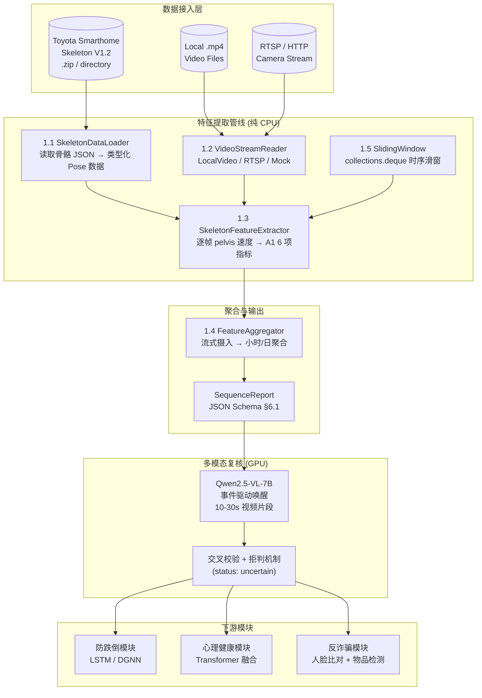

# 居家视频行为感知与分析系统

> **同学A — 视频感知、人体姿态关键点提取、专项行为统计及多模态大模型辅助复核**

[](https://www.python.org/)
[](https://pytorch.org/)
[](https://developer.nvidia.com/cuda-toolkit)
[](./tests/)

---

## 一、项目概览

### 1.1 核心目标

将居家场景下的家庭摄像头视频流转换为**结构化客观行为特征**，同时利用本地部署的 **Qwen2.5-VL-7B-Instruct** 多模态大模型对传统视觉模型难以量化的关键视频片段进行**场景语义复核**。

系统输出"客观事实证据与置信度"，不直接输出医学或心理学诊断结论。

### 1.2 赋能场景

| 场景 | 视频模块贡献 |
|:---|:---|
| **防跌倒** | 骨骼时序流实时输送（15–30fps）、环境异动检测、多摄像头遮挡切换 |
| **心理健康** | 长周期行为特征向量（日级/周级活动量、节律偏移、社交时长）→ Transformer 融合网络 |
| **反诈骗** | 入户人脸多帧聚合比对、涉诈敏感物品检测（银行卡/合同/POS机）、高危交互模式识别 |

---

## 二、系统架构



### 2.1 数据处理流程

```
Skeleton .zip / 目录
  │
  ▼ 1.1 SkeletonDataLoader
SkeletonSequence { frames: [SkeletonFrame] }
  │  ├─ PersonPose { pose2d: (13,2), pose3d: (13,3) }
  │
  ▼ 1.5 SlidingWindow
list[SkeletonFrame]  (window_size=30, stride=15)
  │
  ▼ 1.3 SkeletonFeatureExtractor
FeatureWindow { basic_features: BasicFeatures }
  │  ├─ activity_minutes, sedentary_ratio, room_transitions,
  │  │  average_velocity, night_activity_count,
  │  │  night_activity_duration_seconds, multi_person_duration_seconds
  │
  ▼ 1.4 FeatureAggregator
SequenceReport
  ├─ time_window, basic_features (日级聚合)
  ├─ hourly_breakdown: [HourlyAggregation × 24]
  └─ monitoring_quality
```

---

## 三、快速开始

### 3.1 环境要求

| 组件 | 版本 / 规格 |
|:---|:---|
| 操作系统 | Ubuntu 22.04 |
| Python | 3.10 |
| PyTorch | 2.1.2 |
| CUDA | 11.8 (GPU 模式) |
| GPU | NVIDIA RTX 4090 (24 GB VRAM) — 仅密集跑批时需要 |
| CPU | 16 vCPU Intel Xeon Platinum 8352V |
| 内存 | 120 GB RAM |
| 磁盘 | 系统盘 30 GB + 数据盘 50 GB SSD |

### 3.2 安装

```bash
# 1. 进入项目目录
cd /root/autodl-tmp/psychology_video_project

# 2. 安装 Python 依赖
pip install numpy opencv-python-headless pytest

# 3. (可选) 如需 GPU 推理
pip install torch==2.1.2 torchvision --index-url https://download.pytorch.org/whl/cu118
pip install ultralytics  # YOLOv8-Pose
```

### 3.3 数据集挂载

项目已下载 Toyota Smarthome 数据集至 `dataset/` 目录：

| 文件 | 大小 | 说明 |
|:---|:---|:---|
| `toyota_smarthome_skeleton_v1.2.zip` | ~2.2 GB | 16115 条 refined skeleton 序列 |
| `toyota_smarthome_mp4.tar.gz` | ~12.1 GB | Trimmed RGB 短视频 |
| `Annotation_v1.0.tar.gz` | ~337 KB | Untrimmed 长视频行为标注 |

数据集**无需解压**：`SkeletonDataLoader` 直接读取 `.zip`，`LocalVideoReader` 读取 `.mp4`。

### 3.4 运行测试

```bash
# 全部测试（纯 CPU）
python -m pytest tests/ -v

# 按模块运行
python -m pytest tests/test_data_loader.py -v
python -m pytest tests/test_sliding_window.py -v
python -m pytest tests/test_video_stream.py -v
python -m pytest tests/test_feature_extractor.py -v
python -m pytest tests/test_aggregator.py -v
python -m pytest tests/test_pipeline.py -v
```

### 3.5 快速使用

```python
from src.video_analysis.aggregator import batch_process_sequences

# 一键批处理：Skeleton → 特征提取 → 聚合 → SequenceReport
reports = list(batch_process_sequences(
    "dataset/toyota_smarthome_skeleton_v1.2.zip",
    user_id="ELDER_001",
    device_id="CAMERA_LIVING_01",
    window_size=30, stride=15, fps=15.0,
    max_sequences=10,  # 限制处理条数
))

for r in reports:
    print(r.to_dict())
```

---

## 四、工程目录结构

```
psychology_video_project/
│
├── README.md                          # 项目入口文档（本文件）
├── plan.md                            # 开发任务计划表 + 进度追踪
├── video_tasks.md                     # 同学A 核心任务指令说明书
├── claude_operation_log.md            # Claude Code 自动化操作日志
│
├── dataset/                           # 本地数据集资产
│   ├── toyota_smarthome_skeleton_v1.2.zip   # 2.2 GB，16115 条骨骼序列
│   ├── toyota_smarthome_mp4.tar.gz          # 12.1 GB，RGB 视频片段
│   └── Annotation_v1.0.tar.gz               # 337 KB，行为标注
│
├── src/
│   └── video_analysis/                # 核心模块包
│       ├── __init__.py                # 包元数据
│       ├── config.py                  # 全局常量（关节名称、窗口参数、路径）
│       ├── data_loader.py             # 1.1 — SkeletonDataLoader (zip/目录)
│       ├── sliding_window.py          # 1.5 — SlidingWindow[T] (deque)
│       ├── video_stream.py            # 1.2 — VideoStreamReader (Local/RTSP/Mock)
│       ├── feature_extractor.py       # 1.3 — VideoFeatureExtractor + Skeleton/YOLO
│       └── aggregator.py              # 1.4 — FeatureAggregator + batch 函数
│
├── tests/                             # 单元测试与集成测试
│   ├── conftest.py                    # 共享 fixtures
│   ├── test_data_loader.py            # 15 tests
│   ├── test_sliding_window.py         # 21 tests
│   ├── test_video_stream.py           # 32 tests
│   ├── test_feature_extractor.py      # 27 tests
│   ├── test_aggregator.py             # 24 tests
│   └── test_pipeline.py               # 21 tests (全链路集成)
│
└── .claude/                           # Claude Code 配置
    └── settings.local.json
```

### 4.1 模块依赖关系

```
config.py          ← 无依赖
data_loader.py     ← config
sliding_window.py  ← config
video_stream.py    ← (cv2 可选)
feature_extractor.py ← config, data_loader, sliding_window
aggregator.py      ← config, feature_extractor
```

---

## 五、接口规范 (API & Schemas)

### 5.1 视频结构化行为特征输出（日级/周期级统计）

对应 `video_tasks.md` §6.1，由 `SequenceReport.to_dict()` 产出：

```json
{
  "user_id": "ELDER_603211",
  "device_id": "CAMERA_LIVING_01",
  "sequence_name": "Cook.Cleandishes_p02_r00_v02_c03_pose3d",
  "time_window": {
    "start_time": "08:00:00Z",
    "end_time": "08:06:40Z"
  },
  "monitoring_quality": {
    "effective_duration_seconds": 100.0,
    "missing_frames": 0,
    "occlusion_ratio": 0.0,
    "quality_confidence": 1.0
  },
  "basic_features": {
    "activity_minutes": 0.03,
    "sedentary_ratio": 0.87,
    "room_transitions": 5,
    "average_velocity": 0.0124,
    "night_activity_count": 0,
    "night_activity_duration_seconds": 0.0,
    "multi_person_duration_seconds": 0.0
  },
  "hourly_breakdown": [
    {
      "hour": 8,
      "num_windows": 6,
      "activity_minutes": 0.03,
      "sedentary_ratio": 0.87,
      "room_transitions": 5,
      "average_velocity": 0.0124,
      "night_activity_count": 0,
      "night_activity_duration_seconds": 0.0,
      "multi_person_duration_seconds": 0.0
    }
  ]
}
```

#### 字段说明

| 字段 | 类型 | 说明 |
|:---|:---|:---|
| `user_id` | `string` | 用户唯一标识 |
| `device_id` | `string` | 摄像头设备标识 |
| `sequence_name` | `string` | 数据来源文件名 |
| `time_window` | `object` | 统计时间窗口（`start_time` / `end_time`） |
| `basic_features.activity_minutes` | `float` | 非静止状态的累计分钟数 |
| `basic_features.sedentary_ratio` | `float` | 久坐/静止时间占比 [0, 1] |
| `basic_features.room_transitions` | `int` | 空间区域切换次数 |
| `basic_features.average_velocity` | `float` | 平均 pelvis 移动速度 (m/s) |
| `basic_features.night_activity_count` | `int` | 夜间时段 (22:00–06:00) 活动次数 |
| `basic_features.night_activity_duration_seconds` | `float` | 夜间活动总时长 (秒) |
| `basic_features.multi_person_duration_seconds` | `float` | 多人共现总时长 (秒) |
| `hourly_breakdown` | `array` | 按小时 (0–23) 的指标分解 |
| `monitoring_quality.quality_confidence` | `float` | 数据质量置信度 [0, 1] |

### 5.2 Qwen2.5-VL-7B 事件复核输出 Schema

> ⚠️ **状态：待实现（阶段三）。** 接口已预留。

```json
{
  "$schema": "http://json-schema.org/draft-07/schema#",
  "title": "MLLM_Event_Verification",
  "type": "object",
  "properties": {
    "event_id": { "type": "string" },
    "scene_type": {
      "enum": ["living_room", "bedroom", "kitchen", "entrance", "bathroom", "unknown"]
    },
    "observed_evidence": {
      "type": "object",
      "properties": {
        "human_activity_state": {
          "enum": ["active_reading_or_crafting", "passive_sitting_or_dosing",
                   "aimless_pacing", "normal_walking", "unstable_gait",
                   "lying_down", "unknown"]
        },
        "interaction_context": {
          "enum": ["alone_watching_tv_or_resting", "interacting_with_family",
                   "interacting_with_stranger_or_salesperson", "no_interaction",
                   "unknown"]
        },
        "visible_sensitive_items": {
          "type": "array",
          "items": {
            "enum": ["bank_card", "id_card", "contract_or_document",
                     "health_products_or_medicine", "flyer_or_brochure",
                     "pos_machine", "none"]
          }
        }
      },
      "required": ["human_activity_state", "interaction_context", "visible_sensitive_items"]
    },
    "model_confidence": { "type": "number", "minimum": 0.0, "maximum": 1.0 },
    "uncertain_factors_description": { "type": "string" }
  },
  "required": ["event_id", "scene_type", "observed_evidence",
               "model_confidence", "uncertain_factors_description"]
}
```

### 5.3 Python API 速查

```python
# ---- 1.1 DataLoader ----
from src.video_analysis.data_loader import SkeletonDataLoader
loader = SkeletonDataLoader("dataset/toyota_smarthome_skeleton_v1.2.zip")
seq = loader.load("Cook.Cleandishes_p02_r00_v02_c03_pose3d.json")
for frame in seq.frames:
    pelvis_3d = frame.persons[0].pose3d[0]  # (x, y, z)

# ---- 1.5 SlidingWindow ----
from src.video_analysis.sliding_window import SlidingWindow
sw = SlidingWindow[int](window_size=30, stride=15)
sw.push(item)
if sw.is_ready():
    window = sw.get_window()
    sw.advance()

# ---- 1.2 VideoStream ----
from src.video_analysis.video_stream import create_reader
reader = create_reader("mock://", total_frames=300)  # or local .mp4 / rtsp://
for frame in reader:
    bgr = frame.image  # np.ndarray (H, W, 3)

# ---- 1.3 FeatureExtractor ----
from src.video_analysis.feature_extractor import SkeletonFeatureExtractor
extractor = SkeletonFeatureExtractor("dataset/skeletons.zip")
for fw in extractor.process_sequence("file.json"):
    print(fw.basic_features.activity_minutes)

# ---- 1.4 Aggregator ----
from src.video_analysis.aggregator import FeatureAggregator
agg = FeatureAggregator(fps=15.0, video_start_hour=8.0)
agg.ingest_all(extractor.process_sequence("file.json"))
report = agg.flush_sequence_report(sequence_name="file.json")
```

---

## 六、维护说明

### 6.1 操作日志

所有 Claude Code 自动化操作记录在 `claude_operation_log.md`，采用增量追加方式。格式：

```markdown
### [TIMESTAMP] - 任务阶段名称
* **当前操作动作**：...
* **核心变更说明**：...
* **涉及/修改的文件清单**：...
* **执行结果与验证状态**：...
* **置信度或遗留待办（TODO）**：...
---
```

### 6.2 测试运行

| 命令 | 说明 |
|:---|:---|
| `python -m pytest tests/ -v` | 全部 140 个测试 |
| `python -m pytest tests/ -v -k "real"` | 仅真实数据测试 |
| `python -m pytest tests/ -v --tb=short` | 简短回溯输出 |
| `python -m pytest tests/ -v --cov=src/video_analysis` | 覆盖率报告（需 `pip install pytest-cov`）|

### 6.3 开发进度

| 阶段 | 状态 | 测试数 |
|:---|:---|:---|
| **阶段一 (1.1–1.6)** 数据集接入 + 基础 Tracking | 🟢 已完成 | 140 |
| 阶段二 (2.1–2.7) 专项行为判定 | ⬜ 待开始 | — |
| 阶段三 (3.1–3.5) Qwen2.5-VL-7B | ⬜ 待开始 | — |
| 阶段四 (4.1–4.5) 联调测试 | ⬜ 待开始 | — |

详见 `plan.md` 第六节"任务进度追踪"。

### 6.4 文档更新触发时机

- 每完成一个重要开发阶段后，同步更新本 README 中的架构图、接口说明及运行示例
- 接口签名修改、核心算法重构时必须同步更新 API 文档
- 每次更新前查阅 `claude_operation_log.md` 确保内容与代码一致

---

## 七、无卡模式（CPU 模式）约束

> ⚠️ **重要工作模式说明**

- 所有 `src/video_analysis/` 下的核心业务逻辑**无需 GPU** 即可在纯 CPU 环境运行
- GPU 相关模块（`YOLOPoseFeatureExtractor`、`MLLMVerifier`）提供 `mock` 机制
- 测试套件在检测到无 GPU 时自动跳过核心权重加载，使用合成数据跑通全链路
- 单元测试隔离：涉及神经网络前向传播的部分均有 mock 或自动降级

---

> **下次更新时**：完成阶段二（专项行为判定）后更新架构图、API Schema 及进度表。
