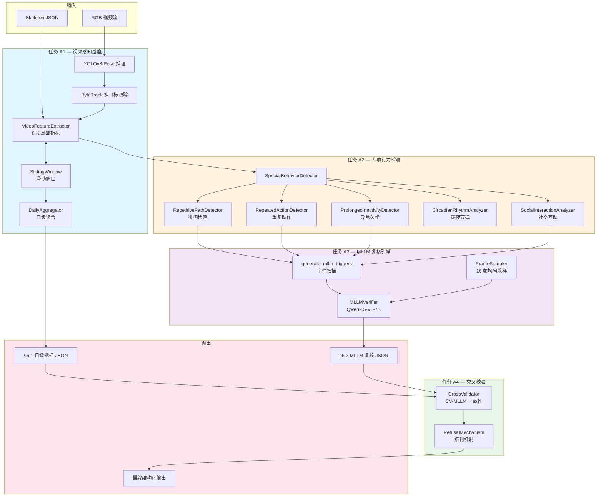
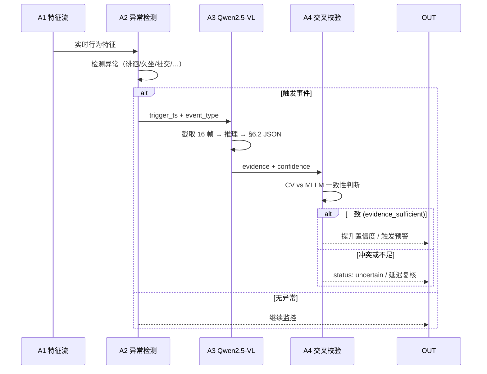

# 心理学视频分析 — 视频识别与大模型辅助判断

> 同学A（视频识别与大模型辅助判断）核心工程仓库

---

## 一、项目概览

将居家场景下的家庭摄像头视频流，转换为可重复统计、高鲁棒性的**结构化客观行为特征**。同时，利用本地部署的 **Qwen2.5-VL-7B-Instruct** 对传统视觉模型难以量化或存在多义性的关键视频片段进行**场景语义复核**，为系统整体输出客观事实证据与置信度。

### 核心场景

- **防跌倒前置防控**：骨骼时序流 → LSTM/DGNN 跌倒识别
- **心理健康风险感知**：日级/周级行为特征向量 → 跨模态融合
- **诈骗风险阻断**：人脸聚合比对 + 敏感物品检测 + 高危交互模式识别

### 技术栈

| 组件 | 技术选型 |
|:---|:---|
| 目标检测与姿态估计 | YOLOv8-Pose (nano) |
| 多目标跨帧跟踪 | ByteTrack (纯 numpy 实现) |
| 多模态大模型 | Qwen2.5-VL-7B-Instruct |
| 运行环境 | AutoDL RTX 4090 (24GB) / PyTorch 2.5.1+cu124 / Python 3.12 |

---

## 二、系统架构



### 事件驱动 MLLM 唤醒流



---

## 三、当前进度

| 阶段 | 内容 | 状态 | 测试 |
|:---|:---|:---|:---|
| **A1** | 视频感知基座 — YOLOv8-Pose + ByteTrack + 6 项指标 + 日级聚合 | ✅ 完成 | 104 tests |
| **A2** | 专项行为检测 — 徘徊/重复/久坐/节律/社交 5 项检测器 | ✅ 完成 | 33 tests |
| **A3** | Qwen2.5-VL-7B 事件复核引擎 — Prompt 模板 + 推理 + Schema 校验 | ✅ 完成 | 28 tests |
| **A4** | 多模型一致性校验与拒判机制 | ❌ 未开始 | — |

### GPU 验证状态

| 视频 | A1+A2 | A3 MLLM | 结果 |
|:---|:---|:---|:---|
| P14T14C06 (~9.6min) | ✅ 99.4 fps | ✅ 1 事件 (repetitive_behavior) | same_route, evidence_sufficient |
| P10T07C04 (~19.5min) | ✅ 99.5 fps | ✅ 2 事件 (repetitive + social) | both evidence_sufficient |
| 其余 8 视频 | ⏳ 待跑批 | ⏳ | — |

---

## 四、快速开始

### 环境要求

- **GPU**: NVIDIA RTX 4090 (24GB VRAM)
- **Python**: 3.12+
- **PyTorch**: 2.5.1+cu124
- **CUDA**: 12.4

### 安装依赖

```bash
pip install ultralytics scipy opencv-python pytest transformers accelerate modelscope
```

### 下载模型

YOLO 模型首次运行时自动下载。Qwen2.5-VL 需手动下载：

```bash
python3 -c "
from modelscope import snapshot_download
model_dir = snapshot_download(
    'qwen/Qwen2.5-VL-7B-Instruct',
    cache_dir='./models',
)
print(f'Done: {model_dir}')
"
```

### 运行全流程 Pipeline

```bash
# 默认视频 (P14T14C06)
python scripts/run_a1_a3_pipeline.py

# 指定视频
python scripts/run_a1_a3_pipeline.py /path/to/video.mp4
```

输出：`results/A1A3/{video_name}_{timestamp}.json`

### 运行测试

```bash
pytest tests/                    # 全量 165 tests
pytest tests/test_mllm_verifier.py  # A3 专项 28 tests
```

---

## 五、工程目录结构

```
psychology_video_project/
├── README.md                          # 本文件
├── video_tasks.md                     # 核心任务指令书（只读参考）
├── plan.md                            # 实施计划
├── claude_operation_log.md            # 自动化操作审计日志
├── .gitignore
│
├── src/
│   ├── video_analysis/
│   │   ├── config.py                  # YAML 配置加载器
│   │   ├── data_loader.py             # 双模式数据加载器
│   │   ├── video_stream.py            # 视频流抽象层
│   │   ├── feature_extractor.py       # A1: 6 项基础指标 + 滑动窗口
│   │   ├── tracker.py                 # ByteTrack 多目标跟踪
│   │   ├── pose_estimator.py          # YOLOv8-Pose (Mock/Real 双模式)
│   │   ├── sliding_window.py          # 通用滑动窗口
│   │   ├── aggregator.py              # A1: 日级聚合器
│   │   ├── special_behavior.py        # A2: 5 项专项行为检测器
│   │   ├── mllm_verifier.py           # A3: Qwen2.5-VL 复核引擎
│   │   ├── cross_validator.py         # A4: 交叉校验 (待实现)
│   │   └── pipeline.py                # 顶层编排器 (待实现)
│   │
│   └── utils/
│       ├── schema_validator.py        # JSON Schema 校验工具
│       ├── frame_sampler.py           # 视频帧采样器
│       └── skeleton_parser.py         # Toyota Smarthome Skeleton V1.2
│
├── tests/                             # Pytest 测试套件 (165 tests)
├── configs/
│   ├── default.yaml                   # 默认配置
│   └── mllm_prompts.yaml              # Qwen2.5-VL System Prompt 模板
├── scripts/
│   ├── run_cpu_pipeline.py            # CPU Mock 管线
│   ├── run_gpu_pipeline.py            # GPU A1+A2 管线
│   └── run_a1_a3_pipeline.py          # GPU A1+A2+A3 全流程
├── dataset/
│   ├── Videos_mp4/                    # 10 个测试视频 (601MB)
│   ├── doubao/                        # 豆包测试视频
│   ├── toyota_smarthome_mp4.tar.gz    # Toyota Smarthome RGB (12GB)
│   ├── toyota_smarthome_skeleton_v1.2.zip  # Skeleton V1.2 (2.1GB)
│   └── Annotation_v1.0.tar.gz         # Untrimmed Annotations
├── models/                            # 本地模型 (gitignored)
└── results/
    └── A1A3/                          # 全流程输出 JSON
```

---

## 六、数据接口规范

### 6.1 日级统计输出

```json
{
  "user_id": "P14T14C06",
  "date": "2026-07-16",
  "daily_metrics": {
    "active_minutes": 9.57,
    "sedentary_ratio": 0.003,
    "room_transition_count": 523,
    "night_activity_count": 68,
    "social_interaction_minutes": 1.81,
    "repetitive_path_count": 0,
    "movement_speed": 0.057,
    "coverage_minutes": 9.57,
    "feature_confidence": 0.84
  },
  "a2_special_behavior": {
    "daily_repetitive_path_count": 0,
    "daily_hotspot_action_count": 5,
    "daily_prolonged_inactive_count": 0,
    "max_inactive_stretch_sec": 12.16,
    "daily_avg_social_intensity": 0.3,
    "circadian": {
      "wake_time": 8.0, "sleep_time": 23.0,
      "wake_offset_hours": 0.0, "sleep_offset_hours": 0.0,
      "is_circadian_disturbed": false,
      "confidence_score": 0.4
    }
  }
}
```

### 6.2 MLLM 事件复核输出

```json
{
  "event_type": "repetitive_behavior",
  "observable_evidence": "老人在厨房与客厅之间来回走动3次，未接触任何物品",
  "analytical_summary": "老人出现焦虑徘徊，疑似焦虑状态，需要关注",
  "start_sec": 0.0,
  "end_sec": 15.0,
  "activity_state": "active",
  "social_context": "alone",
  "repetition_type": "same_route",
  "quality_flags": [],
  "evidence_sufficient": true
}
```

| 字段 | 类型 | 说明 |
|:---|:---|:---|
| `event_type` | enum | `long_inactivity` / `social_interaction` / `repetitive_behavior` |
| `observable_evidence` | string | 只描述画面可见事实 |
| `analytical_summary` | string | 「老人出现[现象]，疑似[结论]，需要关注」|
| `activity_state` | enum | `active` / `sedentary` / `uncertain` |
| `social_context` | enum | `alone` / `co_present` / `interacting` / `uncertain` |
| `repetition_type` | enum | `same_route` / `repeated_search` / `none` / `uncertain` |
| `quality_flags` | array | `occlusion` / `low_light` / `off_camera` |
| `evidence_sufficient` | boolean | 画面证据是否足够，false 时不触发强报警 |

---

## 七、A1 判定算法

### 静止/活动判定（帧级）

```
centroid = (left_hip + right_hip) / 2          # 髋部中点
max_disp = ||centroid_t - centroid_{t-15}||    # 1 秒累计位移
is_still_frame = max_disp < 5.0                # 静止判定 (5px)
```

### 坐姿判定（时间维度）

```
_still_history = deque(maxlen=450)             # 30s × 15fps
still_ratio = sum(still) / 450                 # 过去 30s 静止帧占比
is_sedentary = len(_still_history) >= 450 AND still_ratio >= 0.6
```

### 关键参数

| 参数 | 值 | 说明 |
|:---|:---|:---|
| 推理帧率 | 15 fps | 降采样减少算力消耗 |
| `max_disp` 阈值 | 5 px | 单帧静止判定 |
| `_still_history` | 450 帧 (30s) | 静止回溯窗口 |
| `still_ratio` 阈值 | 60% | 坐姿判定（允许偶尔换姿势） |
| A2 久坐预警 | 1h | 连续静止 ≥1h |
| A2 久坐异常 | 2h | 连续静止 ≥2h |
| 多人最小框 | 40px | 假阳性过滤 |
| MLLM 采样 | 16 帧 | 均匀采样 |
| MLLM 重试 | 2 次 | JSON 解析失败重试 |

---

## 八、维护说明

### 操作日志

每次自动化开发操作均记录在 `claude_operation_log.md`，包含操作动作、变更说明、涉及文件、验证状态和遗留待办。

### 测试运行

```bash
pytest tests/                          # 全量测试 (当前 165 passed)
pytest tests/ -q                       # 安静模式
pytest tests/test_mllm_verifier.py -v  # 单个模块详细输出
```

### Git 提交规范

```bash
<type>(<scope>): <description>
# 例: feat(A3): Batch 3 — Qwen2.5-VL GPU verification
# 例: fix(A3): add missing analytical_summary field
```

### 版本更新

- 每次 A1-A4 阶段完成后更新 README 架构图与进度表
- 接口签名变更时同步更新 §6 接口规范
- 重大 Bug 修复追加到 `claude_operation_log.md`

---

> 项目版本: v4.0 | 更新日期: 2026-07-16 | 基于: `video_tasks.md` §1-§9
