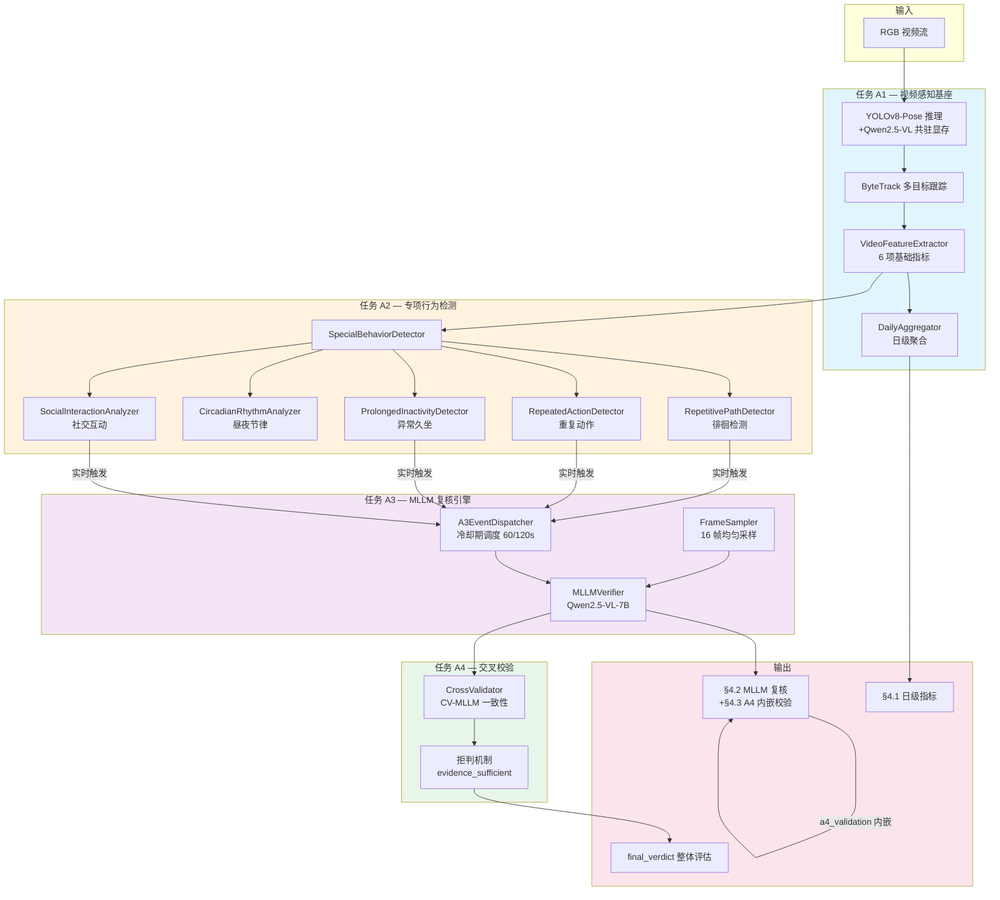
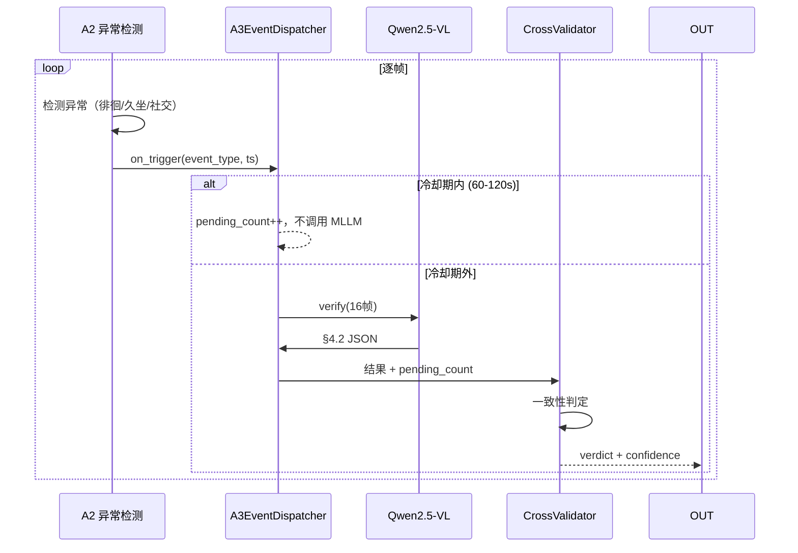

# 心理学视频分析 — 视频识别与大模型辅助判断

> 同学A（视频识别与大模型辅助判断）核心工程仓库

---

## 一、项目概览

将居家场景下的家庭摄像头视频流，转换为可重复统计、高鲁棒性的**结构化客观行为特征**。同时，利用本地部署的 **Qwen2.5-VL-7B-Instruct** 对传统视觉模型难以量化或存在多义性的关键视频片段进行**场景语义复核**，再通过 **CrossValidator** 交叉校验输出客观事实证据与置信度。

### 核心场景

- **防跌倒前置防控**：骨骼时序流 → LSTM/DGNN 跌倒识别
- **心理健康风险感知**：日级/周级行为特征向量 → 跨模态融合
- **诈骗风险阻断**：人脸聚合比对 + 敏感物品检测 + 高危交互模式识别

### 技术栈

| 组件 | 技术选型 |
|:---|:---|
| 目标检测与姿态估计 | YOLOv8-Pose (nano) |
| 多目标跨帧跟踪 | ByteTrack (纯 numpy 实现) |
| 多模态大模型 | Qwen2.5-VL-7B-Instruct |
| 运行环境 | AutoDL RTX 4090 (24GB) / PyTorch 2.5.1+cu124 / Python 3.12 |

---

## 二、系统架构


```mermaid
graph TD
    subgraph 输入
        V[RGB 视频流]
    end

    subgraph A1[任务 A1 — 视频感知基座]
        YOLO[YOLOv8-Pose 推理<br/>+Qwen2.5-VL 共驻显存]
        BT[ByteTrack 多目标跟踪]
        FE[VideoFeatureExtractor<br/>6 项基础指标]
        DA[DailyAggregator<br/>日级聚合]
    end

    subgraph A2[任务 A2 — 专项行为检测]
        SB[SpecialBehaviorDetector]
        RP[RepetitivePathDetector<br/>徘徊检测]
        RA[RepeatedActionDetector<br/>重复动作]
        PI[ProlongedInactivityDetector<br/>异常久坐]
        CR[CircadianRhythmAnalyzer<br/>昼夜节律]
        SI[SocialInteractionAnalyzer<br/>社交互动]
    end

    subgraph A3[任务 A3 — MLLM 复核引擎]
        DP[A3EventDispatcher<br/>冷却期调度 60/120s]
        MV[MLLMVerifier<br/>Qwen2.5-VL-7B]
        FS[FrameSampler<br/>16 帧均匀采样]
    end

    subgraph A4[任务 A4 — 交叉校验]
        CV[CrossValidator<br/>CV-MLLM 一致性]
        RM[拒判机制<br/>evidence_sufficient]
    end

    subgraph 输出
        O1[§4.1 日级指标]
        O2[§4.2 MLLM 复核<br/>+§4.3 A4 内嵌校验]
        O3[final_verdict 整体评估]
    end

    V --> YOLO --> BT --> FE --> DA --> O1
    FE --> SB
    SB --> RP & RA & PI & CR & SI
    RP & RA & PI & SI -->|实时触发| DP --> MV
    FS --> MV --> O2
    MV --> CV --> RM --> O3
    O2 -->|a4_validation 内嵌| O2

    style A1 fill:#e1f5fe
    style A2 fill:#fff3e0
    style A3 fill:#f3e5f5
    style A4 fill:#e8f5e9
    style 输出 fill:#fce4ec
```

### 事件驱动 MLLM 唤醒流（流式）


```mermaid
sequenceDiagram
    participant A2 as A2 异常检测
    participant DP as A3EventDispatcher
    participant A3 as Qwen2.5-VL
    participant A4 as CrossValidator

    loop 逐帧
        A2->>A2: 检测异常（徘徊/久坐/社交）
        A2->>DP: on_trigger(event_type, ts)
        alt 冷却期内 (60-120s)
            DP-->>DP: pending_count++，不调用 MLLM
        else 冷却期外
            DP->>A3: verify(16帧)
            A3->>DP: §4.2 JSON
            DP->>A4: 结果 + pending_count
            A4->>A4: 一致性判定
            A4-->>OUT: verdict + confidence
        end
    end
```

---

## 三、当前进度

| 阶段 | 内容 | 状态 | 测试 |
|:---|:---|:---|:---|
| **A1** | 视频感知基座 — YOLOv8-Pose + ByteTrack + 6 项指标 | ✅ 完成 | 104 tests |
| **A2** | 专项行为检测 — 5 项检测器 + 回调钩子 + 触发历史 | ✅ 完成 | 33 tests |
| **A3** | MLLM 复核引擎 — Prompt + 冷却期调度 + 流式管线 | ✅ 完成 | 28+18 tests |
| **A4** | 交叉校验与拒判 — CrossValidator 已集成 | ✅ Steps 1-4 | 17 tests |
| **A4** | 10 视频全量重跑（含 A4） | ⏳ Step 5 | — |

### GPU 验证状态

| 视频 | 流式管线 | A4 交叉校验 |
|:---|:---|:---|
| P14T14C06 (9.6min) | ✅ 9 MLLM 调用 | ✅ 8 确认 / 1 冲突 |
| P12T05C05 (22.6min) | ✅ 15 MLLM 调用 | ✅ 11 确认 / 4 冲突 |
| 其余 8 视频 | ✅ 全量跑通（Step 6 批量） | ⏳ 待 A4 重跑 |

---

## 四、快速开始

### 环境要求

- **GPU**: NVIDIA RTX 4090 (24GB VRAM)
- **Python**: 3.12+
- **PyTorch**: 2.5.1+cu124
- **CUDA**: 12.4

### 安装依赖

```bash
pip install ultralytics scipy opencv-python pytest transformers accelerate modelscope
```

### 下载模型

YOLO 模型首次运行时自动下载。Qwen2.5-VL 需手动下载：

```bash
python3 -c "
from modelscope import snapshot_download
model_dir = snapshot_download(
    'qwen/Qwen2.5-VL-7B-Instruct',
    cache_dir='./models',
)
print(f'Done: {model_dir}')
"
```

### 运行流式管线（A1+A2+A3+A4）

```bash
# 单视频（默认 P14T14C06）
python scripts/run_streaming_pipeline.py

# 指定视频
python scripts/run_streaming_pipeline.py /path/to/video.mp4

# 10 视频批量
python scripts/run_streaming_batch.py
```

输出：`results/A1A4/{video_name}_streaming_{timestamp}.json`

### 运行测试

```bash
pytest tests/                             # 全量 200 tests
pytest tests/test_cross_validator.py      # A4 专项 17 tests
pytest tests/test_event_dispatcher.py     # A3 冷却期 18 tests
```

---

## 五、工程目录结构

```
psychology_video_project/
├── README.md                          # 本文件
├── video_tasks.md                     # 核心任务指令书（§4.1-§4.3 接口规范）
├── agent.md                           # 工程协作规范（四轨文件/原子提交）
├── plan.md                            # 实施计划 v6.0
├── claude_operation_log.md            # 自动化操作审计日志
├── .gitignore
│
├── src/
│   ├── video_analysis/
│   │   ├── config.py                  # YAML 配置加载器
│   │   ├── data_loader.py             # 双模式数据加载器
│   │   ├── video_stream.py            # 视频流抽象层
│   │   ├── feature_extractor.py       # A1: 6 项基础指标 + 滑动窗口
│   │   ├── tracker.py                 # ByteTrack 多目标跟踪
│   │   ├── pose_estimator.py          # YOLOv8-Pose (Mock/Real 双模式)
│   │   ├── sliding_window.py          # 通用滑动窗口
│   │   ├── aggregator.py              # A1: 日级聚合器
│   │   ├── special_behavior.py        # A2: 5 项检测器 + 回调 + 触发历史
│   │   ├── mllm_verifier.py           # A3: Qwen2.5-VL 复核引擎
│   │   ├── event_dispatcher.py        # A3: 冷却期事件调度器
│   │   ├── cross_validator.py         # A4: CV-MLLM 交叉校验
│   │   └── pipeline.py                # 顶层编排器 (待实现)
│   │
│   └── utils/
│       ├── schema_validator.py        # JSON Schema 校验工具
│       ├── frame_sampler.py           # 视频帧采样器
│       └── skeleton_parser.py         # Toyota Smarthome Skeleton V1.2
│
├── tests/                             # Pytest 测试套件 (200 tests)
├── configs/
│   ├── default.yaml                   # 默认配置
│   └── mllm_prompts.yaml              # Qwen2.5-VL System Prompt ×3
├── scripts/
│   ├── run_cpu_pipeline.py            # CPU Mock 管线
│   ├── run_gpu_pipeline.py            # GPU A1+A2 管线
│   ├── run_a1_a3_pipeline.py          # GPU A1+A2+A3 (batch 模式)
│   ├── run_streaming_pipeline.py      # GPU A1+A2+A3+A4 流式单视频
│   └── run_streaming_batch.py         # GPU 流式 10 视频批量
├── dataset/
│   ├── Videos_mp4/                    # 10 个测试视频 (601MB)
│   └── toyota_smarthome_*.tar.gz      # 数据集压缩包
├── models/                            # 本地模型 (gitignored)
└── results/
    ├── A1A4/                          # 流式全流程输出（含 A4）
    └── archive/                       # 历史结果归档
```

---

## 六、数据接口规范

### 6.1 A1 日级统计输出（§4.1）

```json
{
  "user_id": "P12T05C05",
  "date": "2026-07-26",
  "daily_metrics": {
    "active_minutes": 18.5,
    "sedentary_ratio": 0.59,
    "room_transition_count": 834,
    "night_activity_count": 61,
    "social_interaction_minutes": 0.0,
    "repetitive_path_count": 0,
    "movement_speed": 0.03,
    "coverage_minutes": 22.6,
    "feature_confidence": 0.9
  }
}
```

### 6.2 A3 MLLM 复核输出 + A4 内嵌校验（§4.2 + §4.3）

```json
{
  "a3_mllm_verification": [
    {
      "event_type": "repetitive_behavior",
      "cooling_period": 60,
      "num_of_occurrences": 2,
      "observable_evidence": "老人在客厅与玄关之间来回走动5次，未接触任何物品",
      "analytical_summary": "老人出现固定路线反复走动，疑似焦虑徘徊，需要关注",
      "start_sec": 156.0,
      "end_sec": 176.0,
      "activity_state": "active",
      "social_context": "alone",
      "repetition_type": "same_route",
      "quality_flags": [],
      "evidence_sufficient": true,
      "a4_validation": {
        "verdict": "confirmed",
        "confidence": 0.9,
        "detail": "CV+MLLM 一致：repetition_type=same_route",
        "a2_signal": {
          "a2_source": "repeated_action",
          "event_type": "repetitive_behavior",
          "trigger_ts": 156.0
        },
        "recommend_alert": true,
        "alert_level": "medium"
      }
    }
  ],
  "final_verdict": {
    "overall_status": "alert",
    "total_events": 15,
    "confirmed": 11,
    "conflict": 4,
    "uncertain": 0,
    "recommendation": "11/15 事件经 MLLM 确认属实，建议关注"
  }
}
```

完整字段定义见 `video_tasks.md` §4.1（A1）、§4.1.1（A2）、§4.2（A3）、§4.3（A4）。

---

## 七、核心机制

### A3 冷却期（流式管线）

| event_type | 冷却期 | 冷却期内行为 |
|:---|:---|:---|
| `repetitive_behavior` | 60s | 仅累加 `num_of_occurrences` |
| `social_interaction` | 120s | 仅累加 `num_of_occurrences` |
| `long_inactivity` | 120s | 仅累加 `num_of_occurrences` |

### A4 一致性判定

| A2 信号 | A3 确认 | verdict | 置信度 |
|:---|:---|:---|:---|
| 徘徊/热点触发 | repetition_type = same_route/repeated_search | confirmed | 0.9 |
| 社交强度>0.3 | social_context = interacting/co_present | confirmed | 0.9 |
| 社交强度>0.3 | social_context = alone | **conflict**（CV 假阳性） | 0.4 |
| 任何 | evidence_sufficient = false | uncertain（拒判） | 0.3 |

### 关键参数

| 参数 | 值 | 说明 |
|:---|:---|:---|
| 推理帧率 | 15 fps | 降采样减少算力消耗 |
| YOLO 显存 | ~45 MB | 与 Qwen 共驻 |
| Qwen 显存 | ~15.5 GB | 全程共驻不卸载 |
| MLLM 采样 | 16 帧 | 均匀采样 |
| MLLM 单次推理 | ~10s | 冷却期保证低频调用 |
| 多人最小框 | 40px | 假阳性过滤 |

---

## 八、维护说明

### 操作日志

每次自动化开发操作均记录在 `claude_operation_log.md`，包含操作动作、对应计划锚点、变更说明、涉及文件、验证状态和遗留待办。

### 测试运行

```bash
pytest tests/                             # 全量测试 (当前 200 passed)
pytest tests/test_cross_validator.py -v   # A4 专项
pytest tests/test_event_dispatcher.py -v  # A3 冷却期
```

### Git 提交规范

```bash
<type>(<scope>): <description>
# 例: feat(A4): Step 1 — CrossValidator with dual consistency check
# 例: fix(A3): harden repetition_type enum constraint
```

### 版本更新

- 每次 A1-A4 阶段完成后更新 README 架构图与进度表
- 接口签名变更时同步更新 `video_tasks.md` §4 接口规范
- 重大 Bug 修复追加到 `claude_operation_log.md`

---

> 项目版本: v5.0 | 更新日期: 2026-07-26 | 基于: `video_tasks.md` + `agent.md`
